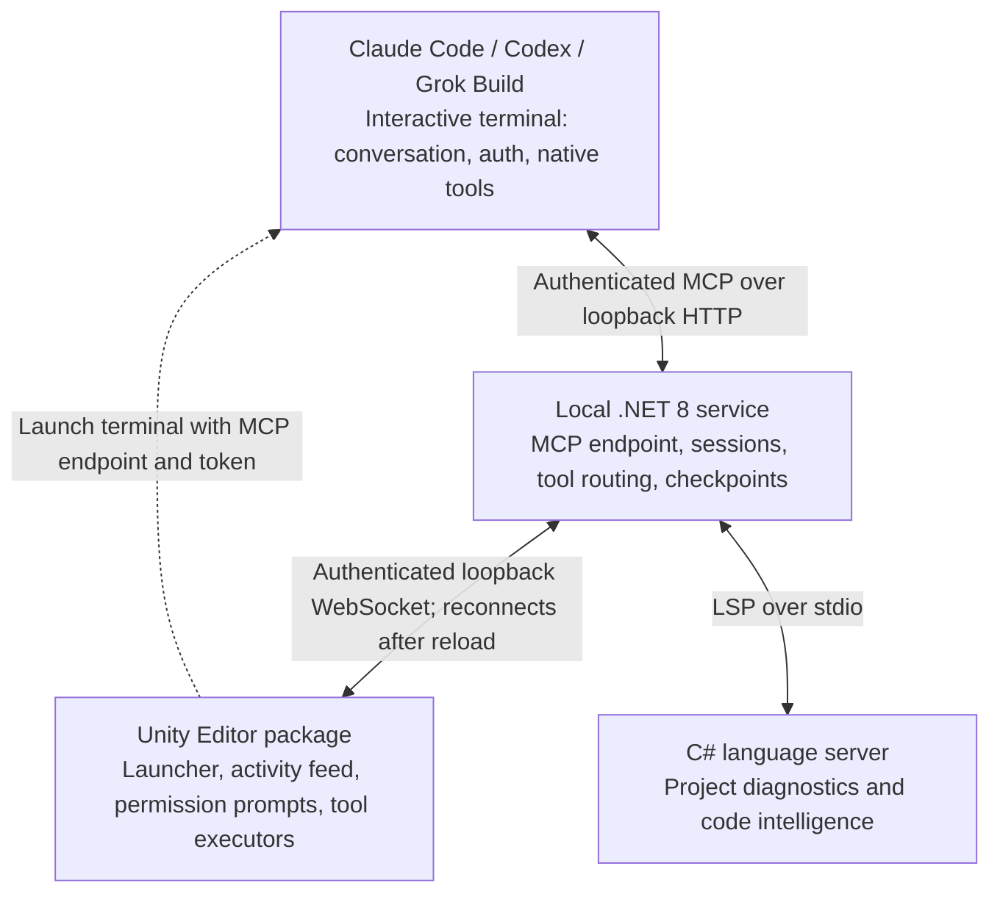

# Unity Assistant (Multi-Provider)

Launch Claude Code, Codex, or Grok Build from Unity and give the coding agent access to your live editor through MCP. The conversation runs in the agent's own terminal; the Unity window shows tool activity and permission prompts.

This is an independent project by [Splatterface Games](https://www.splatterfacegames.com/), not Unity's official Assistant. It is not affiliated with or endorsed by Unity Technologies. Development began before the Unity CLI was released.

## Features

- **Native coding-agent terminals**: Launch Claude Code (labelled Claude Agent in the UI), Codex, or Grok Build with their own authentication and model selection.
- **Live Unity tools**: Inspect and change scenes, assets, scripts, console output, and editor selection through MCP.
- **Editor permission prompts**: Choose a permission mode for each launched session and review gated operations inside Unity.
- **Activity feed**: See the tool calls each connected session makes against the editor.
- **Script reload recovery**: Keep the MCP service running while Unity reloads scripts and reconnect the editor afterward.
- **C# language intelligence**: Expose diagnostics, symbols, navigation, completions, and signature help through a project-scoped language server.
- **Asset generators**: Configure separate provider credentials in Preferences for generator features.

## Architecture

The coding harness owns the conversation, model calls, and its native tools. The Unity package launches it with a session token and the local service's MCP endpoint. The service routes Unity operations to the editor and provides service-side tools such as C# language intelligence and checkpoints.



### Why the service runs outside Unity

Editing C# scripts can trigger a Unity **assembly/domain reload**. The editor process stays open, but its managed objects, static state, and in-process connections are torn down and recreated. Hosting the agent's MCP endpoint entirely inside that domain would drop the agent connection whenever scripts reload—the very operation a coding agent needs to perform repeatedly.

The separate .NET process keeps the agent-facing MCP endpoint and session state alive during the reload. The coding-agent terminal also stays running. Only the Unity-side WebSocket connection needs to reconnect: the package saves the service PID, endpoint, and authentication token in Unity's `SessionState`, then restores the connection after the domain loads again.

Tools that explicitly support reload recovery, such as a recompiling `script.compile_check`, record their pending call ID before the reload and return the fresh result after compilation and reconnection. Editor operations can pause or time out while Unity is unavailable; this is recovery across script reloads, not a guarantee that every in-flight operation survives an editor exit or crash.

## Installation

### Prerequisites

- Unity 2022.3 or later.
- .NET 8 SDK to build the local service.
- At least one supported coding-agent CLI installed and authenticated using its own login flow.

### Setup

1. Clone the repository:

   ```bash
   git clone https://github.com/splatterfacegames/unity-assistant.git
   ```

2. In Unity's Package Manager, select **Add package from disk** and choose `packages/com.splatterfacegames.assistant/package.json` inside the checkout.

3. Publish the service into your Unity project's local service directory. From the repository root, replace the output path below with your actual project path:

   ```bash
   dotnet publish service/Splatter.Service/Splatter.Service.csproj -c Release -o "<Unity project>/LocalPackages/com.splatterfacegames.assistant-service"
   ```

   The current bootstrap searches for `Splatter.Service.exe`; this installation path is intended for Windows. The assembly and source-directory names remain internal implementation names.

4. Open **Preferences > Splatterface Games > Assistant** to check CLI availability. Leave a CLI path empty to use `PATH`, or select its executable explicitly. The harnesses manage their own authentication; generator API keys are configured separately in the same Preferences page.

5. Open **Window > Splatterface Games > Assistant > Chat**. Despite the menu item's name, this window is a launcher and activity feed. Select a permission mode and launch a harness; the package starts the local service and opens the agent's terminal in your Unity project directory.

## Session permissions

The launcher offers **Ask before write**, **Read only**, and **Full auto (YOLO)**. These modes govern access through the assistant's MCP tools. The harness's native file and shell tools retain their own permission controls.

The bridge and MCP endpoint run locally. Model requests made by the harness, and requests from configured generator integrations, can send data to their respective providers; this is not an entirely offline system.

## Available Tools

### Project Tools
- `project.list_files` - List files matching a pattern
- `project.read_file` - Read file contents
- `project.write_file` - Write/create files
- `project.search` - Search for text in project files

### Asset Tools
- `asset.import` - Import external assets
- `asset.create` - Create new assets (materials, scripts, etc.)
- `asset.delete` - Delete assets

### Scene Tools
- `scene.get_hierarchy` - Get scene hierarchy
- `scene.create_gameobject` - Create GameObjects
- `scene.modify_gameobject` - Modify existing GameObjects

### Script Tools
- `script.compile_check` - Check for compilation errors
- `script.get_references` - Get type references
- `csharp.status` - Report C# language-server discovery and capabilities
- `csharp.get_diagnostics` - Get syntax, semantic, and analyzer diagnostics
- `csharp.get_symbols` - Get types and members declared in a script
- `csharp.hover`, `csharp.find_definition`, `csharp.find_references` - Navigate C# semantically
- `csharp.get_completions`, `csharp.get_signature_help` - Query context-aware code intelligence

### C# language server

The local service starts one project-scoped stdio LSP process and shares it across agent sessions. It automatically discovers `csharp-ls` on `PATH` (including `~/.dotnet/tools`) or the Roslyn server installed by the VS Code C# extension. Unity-generated `.sln` and `.csproj` files provide the engine and package references needed for accurate results.

Install the open-source server with:

```bash
dotnet tool install --global csharp-ls
```

For another standard C# LSP server, launch the service with `--csharp-lsp-command <path>` and optional `--csharp-lsp-arguments <args>`. Use `csharp.status` to see which server was selected, its workspace, capabilities, and any startup error.

### Console Tools
- `console.get_logs` - Get Unity console logs
- `console.clear` - Clear the console

### Selection Tools
- `selection.get` - Get current Editor selection
- `selection.set` - Set Editor selection

## Development

### Project structure

```text
unity-assistant/
├── packages/com.splatterfacegames.assistant/
│   ├── Editor/
│   │   ├── Bootstrap/     # Local service lifecycle and reload recovery
│   │   ├── Bridge/        # Editor/service coordination
│   │   ├── Handlers/      # Tool dispatch and deferred reload results
│   │   ├── Launch/        # Harness terminals, context, and sessions
│   │   ├── Mcp/           # MCP registry import/export
│   │   ├── Settings/      # Preferences and project settings
│   │   ├── Tools/         # Unity tool executors
│   │   ├── Transport/     # WebSocket client
│   │   └── UI/            # Launcher, activity feed, and other windows
│   └── Runtime/Contracts/ # Protocol types shared with the service
└── service/
    ├── Splatter.Service/  # .NET 8 MCP service and editor bridge
    └── Splatter.Service.Tests/
```

### Build and test

Run from the repository root:

```bash
dotnet build service/Splatter.Service/Splatter.Service.csproj
dotnet test service/Splatter.Service.Tests/Splatter.Service.Tests.csproj
```

The Unity package contains additional Editor tests that run through Unity's Test Runner.

## License

Licensed under the [MIT License](LICENSE). Copyright © 2026 [Splatterface Games](https://www.splatterfacegames.com/).

## Contributing

Contributions are welcome! Open an issue to discuss a bug or proposed change, or submit a pull request.
